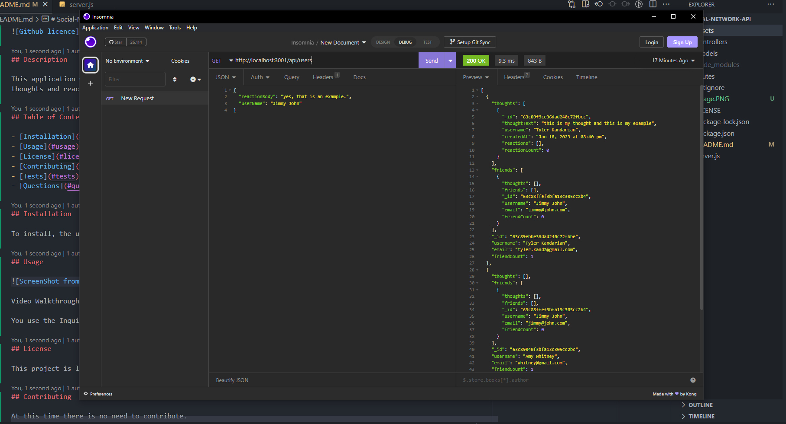

# Social-Network-API

## Description

This application was created to be used as a social netwrok that can handle user data. The user can add, get, detele and update users, friends, thoughts and reactions.

## Table of Contents

- [Installation](#installation)
- [Usage](#usage)
- [License](#license)
- [Contributing](#contributing)
- [Tests](#tests)
- [Questions](#questions)

## Installation

To install, the user needs to clone the repo and and run npm install. Once installed run mpn start and open up the local host within insomnia.

## Usage

Video Walkthrough: https://app.castify.com/view/b43e74a5-37c4-463e-a9a2-3700c72e656f

## License

This project is license under MIT

## Contributing

At this time there is no need to contribute.

## Tests

n/a

## Questions

If you have any questions, please email me at Tyler.Kand2@gmail.com. You can also view more of my work at https://github.com/TylerKandarian.